<h1 align="center">JaKe's Stunt/DM/Freeroam/Minigames/Roleplay</h1>

<p align="center">
    
</p>

<h3 align="center">* Hello, this gamemode made by JaKe Elite is exactly as written, without any modifications, and currently available in version final of the archived SA-MP forum. In addition, all the documentation and code is exactly as written by JaKe Elite</h3>


## Introduction

**Basically this gamemode is for my upcoming official server but decided to release it, Please read below.**

**I have released the gamemode for my own good, My server never gain a player it rarely gets a player. I am now releasing it, have fun on editing it, You may redistribute, use it as long as you keep the /credits. The Gamemode is pretty much base off from my first gamemode FunGaming, except that it has been heavily modified, lots of works has been put into it, SQLite 100% (Well except in the configurations and the house system.) The modes such as DM has been extended, A new open RP world has been implemented as well, It's unfinished though. You can do lots of stuffs in the gamemode, You may stunt, DM, freeroam, and roleplay. We are lack off race system at the moment (unlike FunGaming which has it's own one which is Yagu's). We have removed the race system due to some conflictions and difficulties. The gamemode is still open for updates until we further told you it's the final update. The updates will be focus on patching the bugs though, no further things will be added but bugs fixes.**

> [!NOTE]
> I also released it to focus myself on JakAdmin3.

## Features

• Moneybag System w/ MB Found counting system by [HiC]TheKiller  
• Checkpoint System similar to that TMS, except it is more efficient and accurate.  
• Reaction Contest.  
• Math Quiz by Zezombia, heavily modified.  
• Don't Get Wet by iMon3ky.  
• Horse Shoe System.   
• Deathmatch Arenas.  
• Stunt/Freeroam Maps (5+)  
• Open World of Roleplay (for Roleplay Players).  
• A message for Players and Admins, Players can't see the admin's name who punished someone while admins can.  
• Audio Streaming, /musics and /radios.  
• A Christmas In-Built System which can be enable easily in the script. (Snows, etc..)  
• RC Entering/Exit System by Hiddos.  
• A Premium Shop and VIP system (Incomplete, Half Finished)  
• 98% SQLite.  
• Timestamp for VIP system.  
• Built-In Administrator System.  
• Built-In Helper System.  
• Description System (Describing yourself, Can be viewed on /stats, See Screenshot)  
• Auto Repair System when it reach it's health at 231.  
• Premium Points.  
• Teleport Messages (Textdraw, 4 textdraws)  
• Built In Animation System.  
• Built in AFK system.  
• Built in Duel System.  
• Built in Anti Bike Fall off by Zezombia.  

## Commands

**There are some missing commands but mostly the simple / basic needed stuffs are scripted, You have to add the commands by yourself.**

```pawn
Player Commands:
/ask, /teles, /commands, /premiumshop, /god, /stats, /skin, /hidetd, /car(/v), /staffs, /vips, /name
/descp, /vget, /serverstats, /pm, /credits, /pcmds, /colors, /report, /mb, /hinteriors, /givemoney
/cduel, /duel, /duelaccept, /rate, /keys, /help, /afk, /afks, /shop, /me, /af, (/myt)ime, (/myw)eather
/spos, /lpos, /saveskin, /useskin, /dontuseskin, /kill, /radios, /moff, /musics, /getwet, /startwet, /rules

Christmas Edition if enabled: /snow
Roleplay World: /b, /me, /do, /o, (/l)ow, (/s)hout

Helper Commands: /a, /ask, /kick, /slap, /explode
Admin Commands:

Level 1:
/a, /ask, /adminduty, /toggleadmin, /clearchat, /jetpack, /startmb, /startcp, /reaction, /kick, /slap
/startmath, /explode, /clearteleport, /(un)mute, /warn, /announce(ann), /jail, /reports, /goto
/spec, /specoff, /muted

Level 2:
/giveweapon, /ban, /unban, /(un)mutecmd, /get, /remwarn, /disarm, /unjail, /ip, /spawn, /gotohouse
/jailed, /cmuted, /heal, /akill

Level 3:
/givepp, /setvip, /random, /setinterior, /setworld, /oban, /respawnveh, /gotoco, /setname, /setskin
/armour

Level 4:
/sethelper, /setscore, /setmoney, /fakechat, /addhouse, /hmove, /asellhouse, /hnear, /healall, /armourall
/kickall, /gotohs

Level 5 (Owner Rank):
/vip, /setlevel, /setpremium, /removehouse, /fakecmd, /lockserver, /unlockserver, /hostname, /dhostname
/seths
```

## SQLite

**For these new scripters out there, this gamemode uses SQLite, which means it uses the format .db instead of .ini which you can open up with Notepad, However .db is different, you need an application to view it's database (Player users, Ban and stuffs) Please download this.**

**It can be only open with SQLite Browser which can be downloaded**

[SQLite Database Browser](https://sqlitebrowser.org/)

## Shortcut

• **Press 2 for flip and repair.**  
• **Press N for Vehicle Jump.**  
• **Press LMB twice (or hold it) for boosting and NOS (if your vehicle supports it)**  
• **Press Y for super handbrake (If you have it bought at /premiumshop)**  

## Screenshot

### (Notice some textdraws are missing, It's normal, the server is in BETA 1)

<p align="center">
    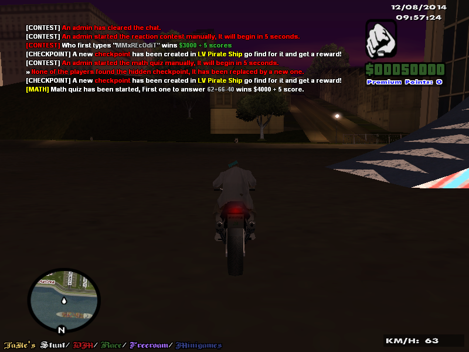
</p>

<p align="center">
    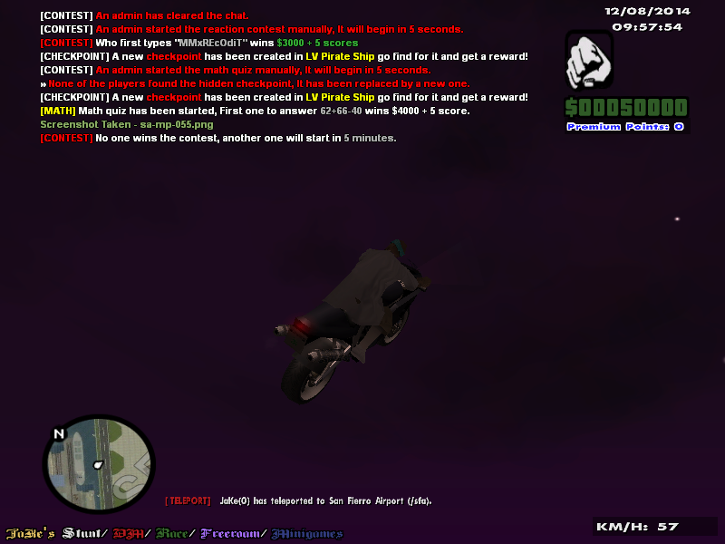
</p>

### (A house system < JakHouse, This is BETA 2 before the final version)

<p align="center">
    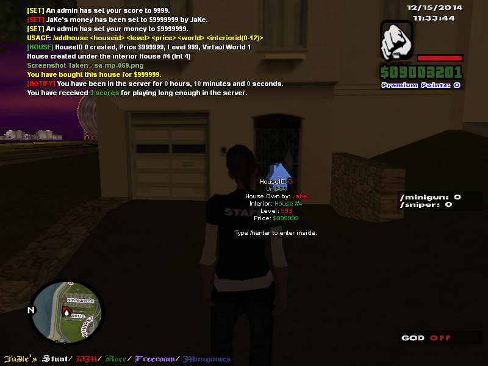
</p>

### (Final version)

<p align="center">
    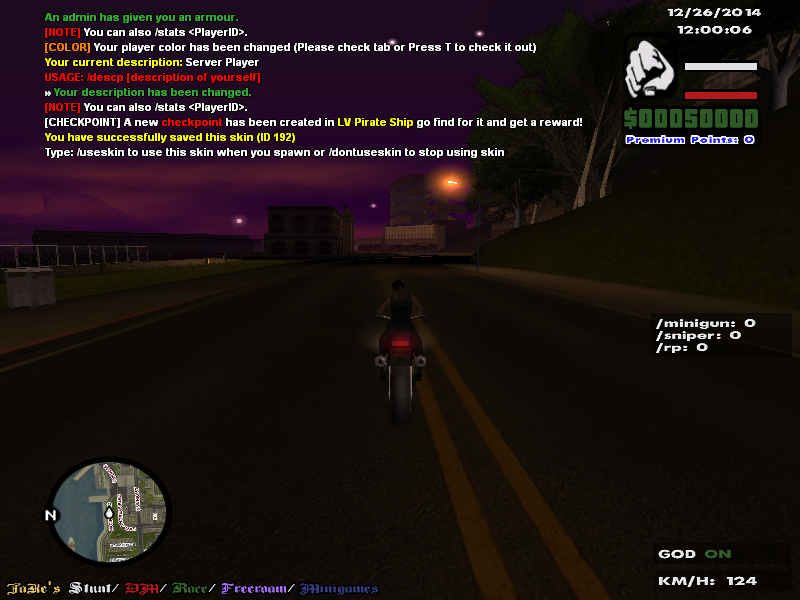
</p>

<p align="center">
    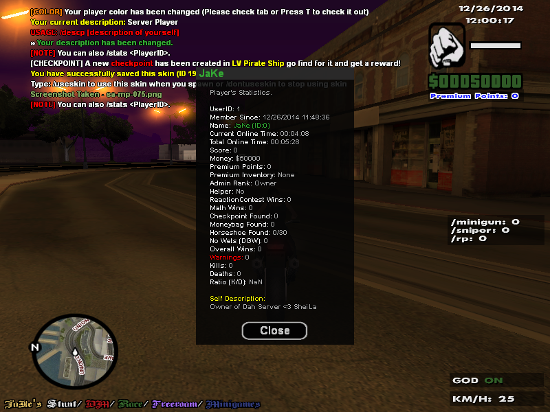
</p>

<p align="center">
    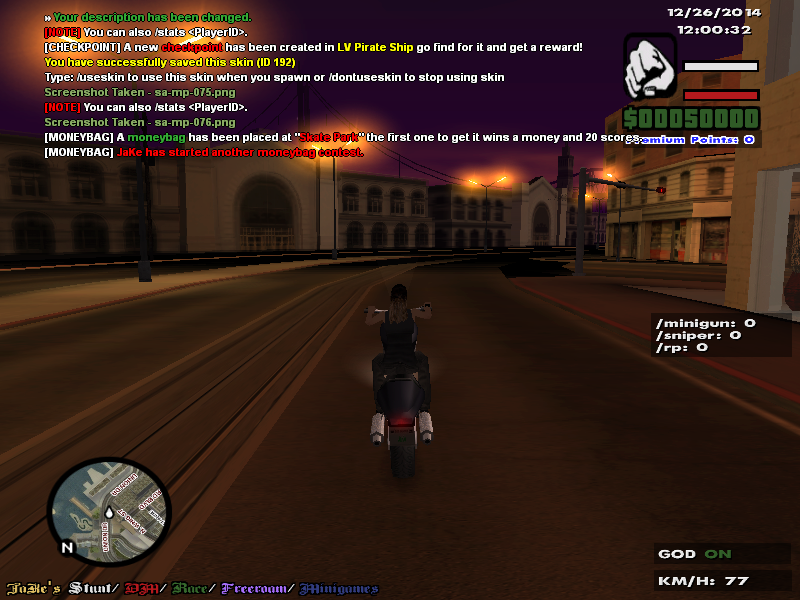
</p>

<p align="center">
    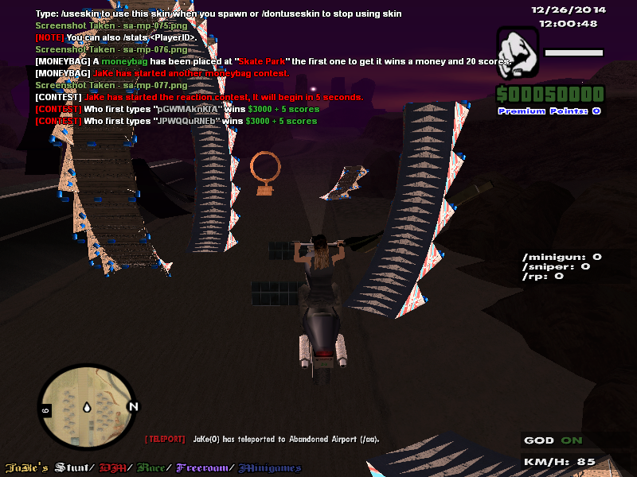
</p>

<p align="center">
    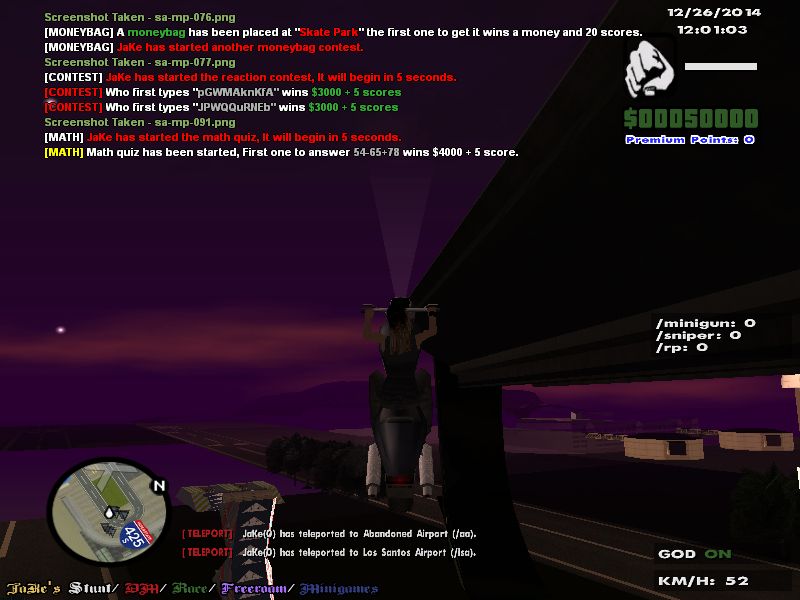
</p>

<p align="center">
    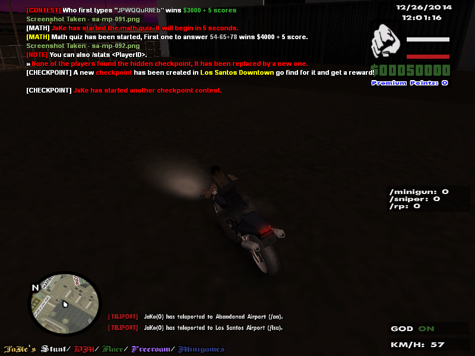
</p>

<p align="center">
    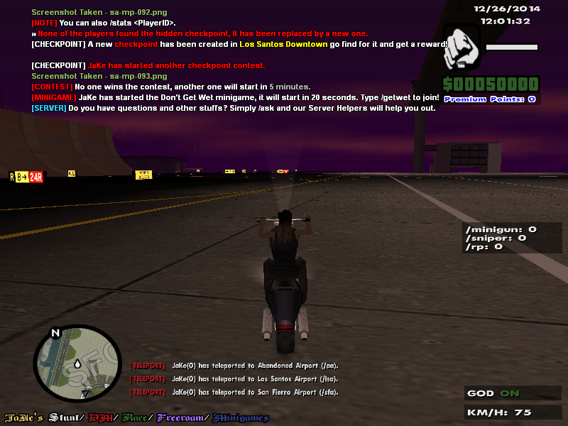
</p>

<p align="center">
    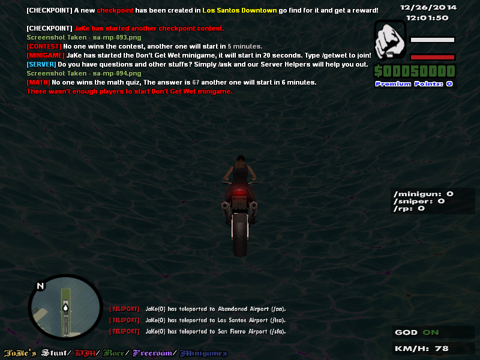
</p>

## Download

|  Version | Link  | Upload Site | Supports SA-MP |
|----------|-------|-------------|----------------|
| Complete | [Click](https://github.com/Straydet/JaKe-s-Stunt-DM-Freeroam-Minigames-Roleplay/releases/tag/Original) |    [Github](https://github.com/Straydet/JaKe-s-Stunt-DM-Freeroam-Minigames-Roleplay)   |      0.3.7     |

## Credits

**_JaKe <- (JaKe Elite)_**  
**_[HiC]TheKiller, Zezombia, andrewgrob, Sneaky, Mike, Roach, Hiddos, Kwarde, LethaL, BlueRey, iMonk3y_**  

**_Testers: Creed, Stuun, AlexM, Jeton, Ashirwad, DarKLord and all the players who participated/joined the server._**  
**_Other: SA-MP Forums (Maps/Scripts)_**  

## Original

- [[GameMode] JaKe's Stunt/DM/Freeroam/Minigames/Roleplay - SA-MP Forum](https://sampforum.blast.hk/showthread.php?tid=552677)
